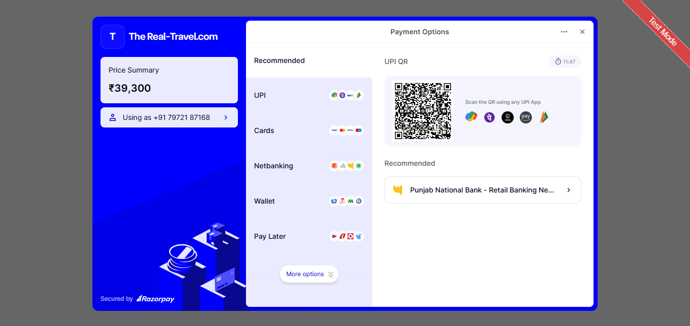

# 🌍 The Real-Travel – Tourism Web Application

A full-stack tourism booking platform built for desktops and laptops. This project focuses on essential travel functionalities such as user authentication, simulated payments, email notifications, and admin control.

---

## 🚀 Features

- 🔐 **User Authentication**
  - Login, Registration, Forgot Password
  - Secure Email Verification

- 💳 **Payment Integration**
  - Razorpay Integration (Test Mode API Key)
  - Simulated secure payments during booking

- 📧 **Email Functionality**
  - Account verification emails
  - Booking confirmations
  - Payment receipts via PHPMailer

- 🛠️ **Admin Panel**
  - Full CRUD operations
  - Manage Users, Destinations, and Bookings

---

## 🛠 Tech Stack

- **Frontend:** HTML, CSS, JavaScript  
- **Backend:** PHP  
- **Database:** MySQL  
- **Others:** PHPMailer, Razorpay (Test Mode)

---

## 📷 Screenshots

### 🏠 Home Page


### 🛠️ Admin Panel


### 📦 Packages


### 💳 Payment Integration (Razorpay)


### 💳 Payment Slip (Receive Email)
 
---

## 🌐 Live Demo

🔗 [Live Website (Desktop Only)](http://realtravel.42web.io)  
📦 [GitHub Source Code](https://github.com/HarshVathare/Mager_Project)

---

## 📌 Note

> This application is optimized for desktop and laptop use. Responsive/mobile version coming soon!

---

## 🙋‍♂️ Author

**Harshvardhan Vathare**  
📧 harsh1234vathare@gmail.com  
🔗 [LinkedIn Profile](https://www.linkedin.com/in/harshvardhan-vathare-823a86276/)

---

## ⭐ How to Use / Run Locally

### 🔽 1. Clone the Project into `htdocs`

Open **Command Prompt** or **Git Bash** and run:

```bash
cd C:\xampp\htdocs
git clone https://github.com/HarshVathare/Mager_Project.git
rename Mager_Project real-travel
```

---

### ⚙️ 2. Start Apache & MySQL in XAMPP

- Open **XAMPP Control Panel**
- Start **Apache** and **MySQL**
- Ensure:
  - Apache runs on port **80**
  - MySQL runs on port **3306**

💡 If ports differ:
- Click `Config` > `httpd.conf`
- Find `Listen 80` → Change to `Listen 8080`
- Save and restart Apache

---

### 🗄️ 3. Import the MySQL Database

1. Go to: [http://localhost/phpmyadmin](http://localhost/phpmyadmin)  
2. Click **Import**
3. Select `real_travel.sql` from `/htdocs/real-travel/`
4. Click **Go**

---

### 🛠️ 4. Update Database Credentials

In `db.php`, make sure these values are set:

```php
$host = "localhost";
$username = "root";
$password = "";
$database = "real_travel";
```

Save the file.

---

### 🌐 5. Run the Project in Your Browser

If using default port:

```
http://localhost/real-travel
```

If using custom port (e.g., 8080):

```
http://localhost:8080/real-travel
```

---

### ✅  Congratulations 🎉  
Your project is now running successfully!
